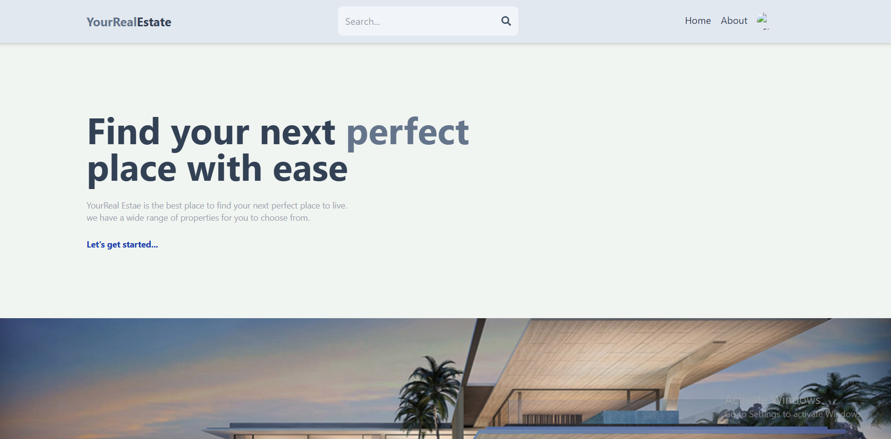
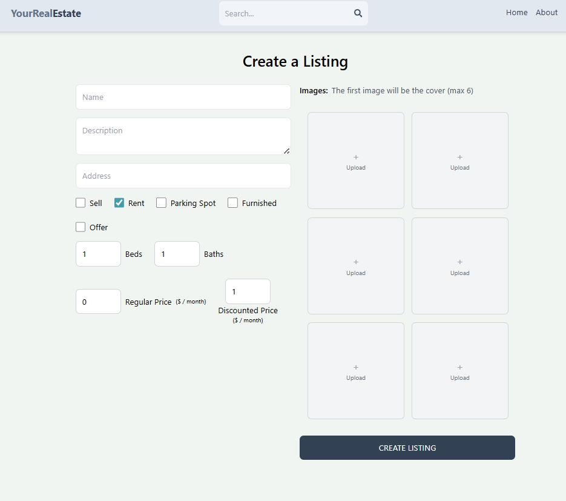
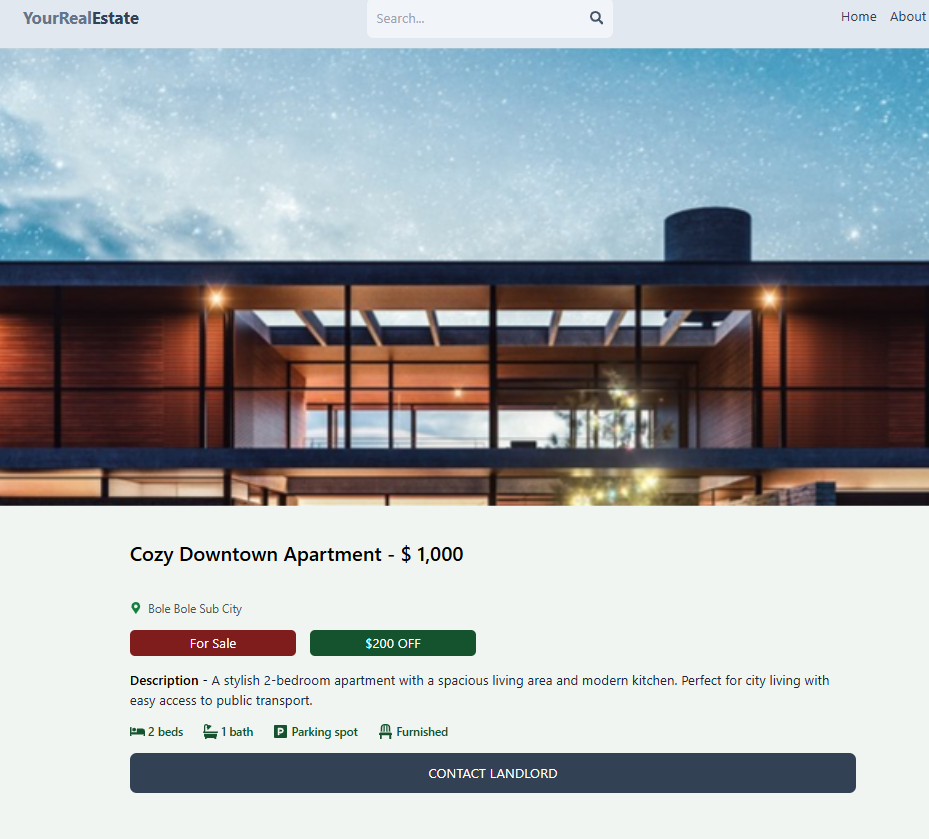
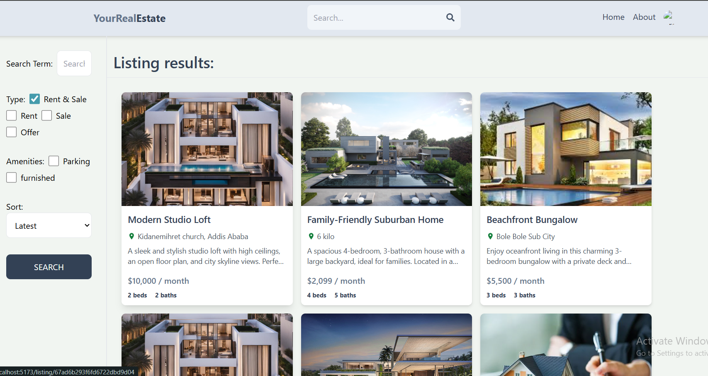
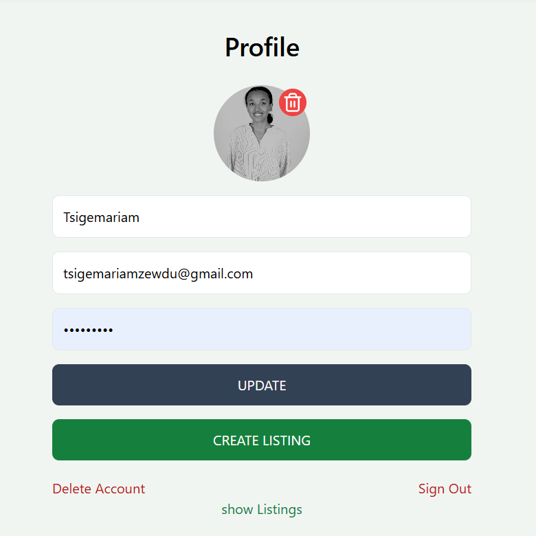

# 🏠 Real Estate Platform


**Live Demo:** 🔗 [https://your-real-estate.onrender.com/](https://your-real-estate.onrender.com/)

---

## 🚀 Project Overview

**Real Estate Platform** is a modern full-stack application designed to connect landlords and potential renters or buyers.
It allows landlords to list properties with details and images, and enables users to search, browse, and contact landlords directly.
This project demonstrates skills in **full-stack development, API design, and real-world web application deployment**.

---

### 🔍 Key Features

* **Create Property Listings** — Upload property details including title, description, price, location, and images.
* **Search Properties** — Filter listings by location, price, and offers.
* **View Property Details** — Detailed listing pages with all property info.
* **Contact Landlords** — Direct contact via provided information.
* **Responsive Design** — Optimized for both desktop and mobile devices.

---

### 🛠 Tech Stack

| Layer    | Technology                      |
| -------- | ------------------------------- |
| Frontend | React.js, HTML, CSS, JavaScript |
| Backend  | Node.js, Express.js             |
| Database | MongoDB                         |
| Hosting  | Render                          |
| Others   | CORS, REST API                  |

---


---

### ⚙ Installation & Setup

1. **Clone the repo**

   ```bash
   git clone https://github.com/tsigemariamzewdu/real-estate-platform.git
   cd real-estate-platform
   ```

2. **Install dependencies**

   ```bash
   npm install
   ```

3. **Setup environment variables**
   Create a `.env` file in the backend folder:

   ```
   
   MONGO_URI=your_mongo_connection_string
   ```

4. **Run backend server**

   ```bash
   npm run dev
   ```

5. **Run frontend**

   ```bash
   cd frontend
   npm run dev
   ```

6. Open your browser:

   ```
   http://localhost:5173
   ```

---

### 📜 API Endpoints


### 📸 Screenshots

#### Landing Page


#### Create Listing Page


#### Real Estate Detail Page


#### Search Page


#### User Profile Page



---

### 🤝 Contributing

Contributions are welcome!

1. Fork the repo
2. Create a new branch (`git checkout -b feature/feature-name`)
3. Commit your changes (`git commit -m "Add feature"`)
4. Push to the branch (`git push origin feature/feature-name`)
5. Open a Pull Request

---


